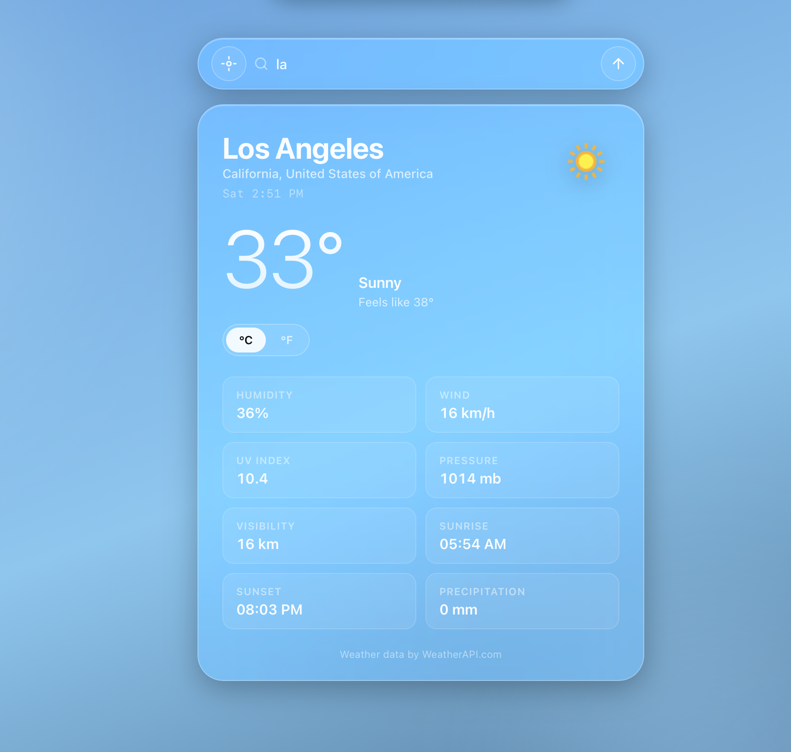

# Weather App

<div align="center">
  
</div>

<br />

<div align="center">
  <a href="https://weather-app-nine-eta-90.vercel.app/" target="_blank">
    
  </a>
  
  
</div>

---

A sleek, responsive weather app built with **HTML**, **CSS**, and **JavaScript**.  
It uses **WeatherAPI** to fetch live weather data, tries the user’s location first, and falls back to **Delhi** if location access is unavailable.

## Live Demo

🔗 [Open the app](https://weather-app-nine-eta-90.vercel.app/)

## What It Does

- Tries to detect your location on load.
- Shows weather for your current city when geolocation is allowed.
- Falls back to Delhi if location access fails.
- Lets you search weather for any city.
- Keeps the UI minimal, modern, and mobile responsive.

## Features

- Glassmorphism-style interface.
- Clean and simple layout.
- Live weather data via WeatherAPI.
- City search with instant updates.
- Responsive design for mobile and desktop.
- Useful weather details like temperature, humidity, wind speed, and feels like.

## Tech Stack

- HTML5
- CSS3
- JavaScript
- WeatherAPI

## How to Run Locally

```bash
git clone https://github.com/your-username/weather-app.git
cd weather-app
```

Then open `index.html` in your browser.

## Build Notes

I made this project or shall I say vibecoded it using Claude as a fast live build to learn, ship, and practice building in public.  
Simple idea, clean execution, and quick deployment on Vercel.
